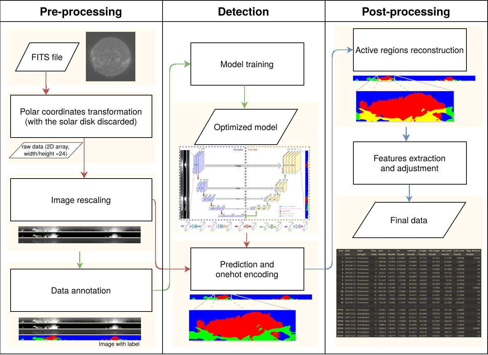

# Solar Prominence & Active Region Detector & Analyzer

## What software (or language) is needed?
TL;DR, only Julia and Python.
This project is predominantly written in Julia, with certain components implemented in Python. Post-processing in the initial implementation involved some IDL code, but those components have been rewritten using SunPy. They may be rewritten in Julia in the future.

Both the project and its associated packages are open-source. Once the SDO/AIA 304 Å data is prepared, there is no need for IDL.

## What is this project for?
This project utilizes a combination of image processing and deep learning techniques to create an efficient pipeline that pre-processes SDO/AIA 304 Å data, detects prominences and active regions, and performs post-processing on images.

## Where can I find the result?
We have made critical data publicly available, including: trained models, inference results of over 3000 images from SDO/AIA 304 Å from 2010 to 2020, and extracted statistics from the prediction results. Detailed descriptions are provided [here](data/READEME.md).

## Will all the code be uploaded to the repository?
TL;DR, there is no such plan at present but we believe that the uploaded code and data are sufficient for reproducibility.
The analysis of data extracted from prediction results involves extensive experimentation.
As a result, a substantial amount of computational code is coupled with plotting code within a "repeating itself" Jupyter notebook, contradicting the coding principle of "don't repeat yourself".

Additionally, some code not closely related to this project, such as scripts for converting JSON files recording data annotations into labeled images, has not been uploaded to the repository.

## How to use the code?

### Preparation
- Ensure that the directory structure complies with the data directory structure recommendations we provided [here](data/READEME.md).
- Install `Julia` and activate the environment specified in `Projet.toml`.
- Install Python, PyTorch, Numpy, etc.

### Execution Order
- `cd` to `src/julia`
- Run `julia --project pre_process.jl` to generate the pre-processed figures from FITS files.
- `cd` to `src/python`
- Run `python train.py` to train the model.
- Run `python predict.py` to predict results with the trained model.
- `cd` to `src/julia`
- Run `julia --project post_process.jl` to do some post-processing.
- Run `julia --project statistic.jl false` to generate the `.csv` file from the post-processed results for the first time.

## About Reproducibility
Given that randomness should only come from the model's training process, the remaining components of the program are expected to be reproducible unless alterations in the algorithms used by different software versions occur (although this possibility is minimal).

Further information on the reproducibility of model training can be found [here](data/READEME.md).
